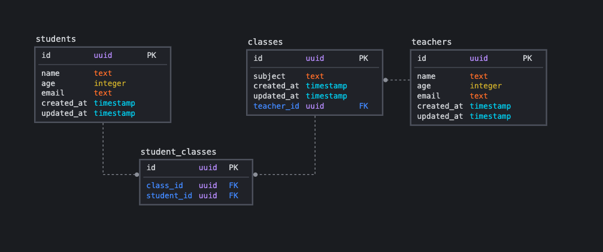
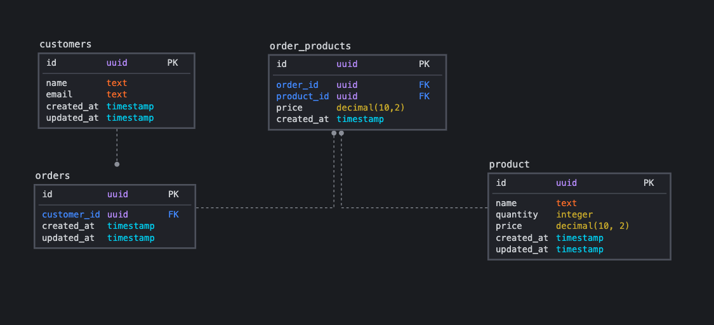

<p align="left">
   
</p>

# TypeORM Relationships

> Learn how to perform relationships in TypeORM

> [](https://insomnia.rest/run/?label=Hotseat%20API&uri=https%3A%2F%2Fraw.githubusercontent.com%2FLauraBeatris%2Ftypeorm-relations%2Fmaster%2F.github%2Ftypeorm_relations.json)

[](https://github.com/LauraBeatris)
[](#)
[](https://github.com/LauraBeatris/typeorm-relations/stargazers)
[](https://github.com/LauraBeatris/typeorm-relations/network/members)
[](https://github.com/LauraBeatris/typeorm-relations/graphs/contributors)

# :pushpin: Table of Contents

* [Features](#rocket-features)
* [Database Model](#clipboard-features)
* [Learning Sources](#orange_book-learning-sources)
* [Installation](#construction_worker-installation)
* [Getting Started](#runner-getting-started)
* [FAQ](#postbox-faq)
* [Found a bug? Missing a specific feature?](#bug-issues)
* [Contributing](#tada-contributing)
* [License](#closed_book-license)

# :rocket: Features

* 🛍&nbsp; Store orders, products and customers
* 📔&nbsp; Store students, classes and teachers

# :clipboard: Database Model

In order to understand the relationships, I've created the following database models:

<p align="center">
   
</p>

<p align="center">
   
</p>

# :orange_book: Learning Sources

- [Relations in TypeORM](https://orkhan.gitbook.io/typeorm/docs/relations)
- [What are Many To Many Relations](https://typeorm.io/#/many-to-many-relations/what-are-many-to-many-relations)
- [Many to Many Entities in TypeORM](https://www.youtube.com/watch?v=RH_es0awU_A)
- [Saving Many to Many Relations with only one save call](https://typeorm.io/#/relations/cascades)

# :construction_worker: Installation

**You need to install [Node.js](https://nodejs.org/en/download/) and [Yarn](https://yarnpkg.com/) first, then in order to clone the project via HTTPS, run this command:**

```
git clone https://github.com/LauraBeatris/typeorm-relations.git
```

SSH URLs provide access to a Git repository via SSH, a secure protocol. If you use a SSH key registered in your Github account, clone the project using this command:

```
git clone git@github.com:LauraBeatris/typeorm-relations.git
```

**Install dependencies**

```
yarn install
```

Or

```
npm install
```

Create your enviroment variables based on the examples of ```.env.example```

```
cp .env.example .env
```

After copying the examples, make sure to fill the variables with new values.

**Setup a database**

Install [Postgres](https://www.postgresql.org/) to create a database or if you have [Docker](https://www.docker.com/) in your machine, fill the environment values related to database configurations and then run the following commands in order to create a Postgres container.

```docker-compose up```

# :runner: Getting Started

Run the transactions in order to configure the database schema

```yarn typeorm migration:run```

Run the following command in order to start the application in a development environment:

```yarn dev:server```

# :postbox: Faq

**Question:** What are the tecnologies used in this project?

**Answer:** The tecnologies used in this project are [NodeJS](https://nodejs.org/en/) + [Express Framework](http://expressjs.com/en/) to handle the server and [TypeORM](https://typeorm.io/#/)

# :bug: Issues

Feel free to **file a new issue** with a respective title and description on the the [TypeORM Relations](https://github.com/LauraBeatris/typeorm-relations/issues) repository. If you already found a solution to your problem, **I would love to review your pull request**! Have a look at our [contribution guidelines](https://github.com/LauraBeatris/typeorm-relations/blob/master/CONTRIBUTING.md) to find out about the coding standards.

# :tada: Contributing

Check out the [contributing](https://github.com/LauraBeatris/typeorm-relations/blob/master/CONTRIBUTING.md) page to see the best places to file issues, start discussions and begin contributing.

# :closed_book: License

Released in 2020.
This project is under the [MIT license](https://github.com/LauraBeatris/typeorm-relations/master/LICENSE).

Made with love by [Laura Beatris](https://github.com/LauraBeatris) 💜🚀
